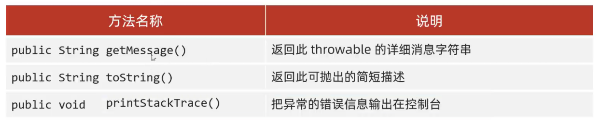

# Java-note

## 一、注释与关键字

​	单行注释采用 //注释信息  	多行注释采用/*   */   文档注释采用/**    */

​	关键字字母全部小写，Java中共有50个关键字

​	class：用于创建或定义一个类，类是Java最基本的组成单元。其后跟随类名

## 二、字面量

| 字面量类型 | 说明                             | 举例                    |
| ---------- | -------------------------------- | ----------------------- |
| 整数类型   | 不带小数点的数字                 | 666，-88                |
| 小数类型   | 带小数点的数字                   | 13.14，-5.21            |
| 字符串类型 | 用双引号括起来的内容             | "HelloWorld"，"你好"    |
| 字符类型   | 用单引号括起来的，内容只能有一个 | ‘A’，'0'，‘我’          |
| 布尔类型   | 布尔值，表示真假                 | 只有两个值：true，false |
| 空类型     | 一个特殊的值，空值               | 值是：null              |

注：null不能直接打印

/t：制表符，再打印的时候，把前面的字符串的长度补齐到8，或者8的倍数。最少补一个空格，最多补8个空格。

## 三、Java基础语法

### 1、数据类型

| 数据类型 | 关键字    | 内存占用 | 取值范围                                  |
| -------- | --------- | -------- | ----------------------------------------- |
| 整数     | `byte`    | 1        | 负的2的7次方 ~ 2的7次方-1(-128~127)       |
|          | `short`   | 2        | 负的2的15次方 ~ 2的15次方-1(-32768~32767) |
|          | `int`     | 4        | 负的2的31次方 ~ 2的31次方-1               |
|          | `long`    | 8        | 负的2的63次方 ~ 2的63次方-1               |
| 浮点数   | `float`   | 4        | 1.401298e-45 ~ 3.402823e+38               |
|          | `double`  | 8        | 4.9000000e-324 ~ 1.797693e+308            |
| 字符     | `char`    | 2        | 0-65535                                   |
| 布尔     | `boolean` | 1        | true，false                               |

注：定义long类型时定义的数值后面需加L或l

​	   定义float类型时定义的数值后面需加F或f

### 2、标识符

#### 命名规则

- 由数字、字母、下划线(_)、和美元符($)组成
- 不能以数字开头
- 不能是关键字
- 区分大小写

小驼峰命名法：单个单词做变量名时首字母小写，多个单词做命名时首字母小写，其他单词首字母大写。

例如：`name`	`firstName`

大驼峰命名法：单个单词做变量名时首字母大写，多个单词做命名时每个单词首字母都大写。

例如：`Student`	`GoodStudent`

### 3、键盘录入


可以通过 Scanner 类来获取用户的输入。

下面是创建 Scanner 对象的基本语法：

```java
Scanner s = new Scanner(System.in);
```

## 四、IDEA

Java项目基本结构：

### project（项目）

#### 	module（模块）

##### 		package（包）

###### 			class（类）

## 五、运算符

### 1、隐式转换和强制转换

#### 隐式转换

- 取值范围：`byte` < `short` < `int` < `long` < `float` < `double`
- 数据类型不同，不能进行计算，需要转换成一样的才能进行计算
- 取值范围小的，和取值范围大的进行计算，小的会先提升为大的，再进行计算
- `byte`   `short`   `char`三种类型的数据在运算的时候，都会直接提升为`int`，然后再进行计算

#### 强制转换

- 如果把一个取值范围大的数值赋值给一个取值范围小的变量，是不允许直接复制的。如果一定要这么做就需要加入强制转换。
- 格式：目标数据类型 变量名=（目标数据类型）被强制转换的数据。
  - 例如：double a = 12.3	int b = (int) a;

- 将超出某变量的取值范围的数值赋值给该变量时，会报错；强制转换同理。

### 2、字符串和字符的加操作

#### 字符串的加操作

- 当“+”操作中出现字符串时，这个“+”是字符串连接符，而不是算术运算符。会将前后的数据进行拼接，并产生一个新的字符串。
- 连续进行“+”操作时，从左到右逐个进行。
  - 如1 + 99 + “年”	其输出结果为：100年

#### 字符的加操作

- 当“字符+字符”或“字符+数字”时，会把字符通过ASCII码表查询到对应的数字再进行计算。

### 3、自增自减运算符

#### “++”和“--”

“++”和“--”无论是写在变量前还是变量后，都表示变量本身+1或-1

### 4、赋值运算符

#### 扩展复制运算符

##### 分类：

​	+=、-=、*=、/=、%=

##### 运算规则：

​	就是把左边跟右边进行运算，把最终的结果赋值给左边，对右边没有任何影响。

**注：扩展的赋值运算符中还包含了一个强制转换**

### 5、逻辑运算符

| 符号 | 作用         | 说明           |
| ---- | ------------ | -------------- |
| &    | 逻辑与（且） | 且，同真则真   |
| \|   | 逻辑或       | 或，同假则假   |
| ^    | 逻辑异或     | 同为假，异为真 |
| !    | 逻辑非       | 相反           |

### 6、短路逻辑运算符

#### &&

令条件A为P，条件B为Q；P & Q会先判断P，即便P不成立还会再次判断Q，效率较低。而P && Q会先判断A，如果不符合A则直接得出结果为False。

#### ||

同上，第一个条件满足即可。

### 7、三元运算符和运算符的优先级

#### 三元运算符

格式：关系表达式 ？表达式1：表达式2

通过关系表达式进行判断，如果为True则采用表达式1，如果为False则采用表达式2

#### 运算符的优先级

## 六、判断与循环

### 1、Switch语句

`switch`语句后衔接要匹配的值，该值可以是`byte`、`short`、`int`、`char`、`枚举`、`String`

jdk12更新后简化了`switch`语句，如：

```java
int number = 10;
switch (number) {
    case 1 -> {System.out.println("一");
              }
    case 2 -> {System.out.println("二");
              }
    case 3 -> {System.out.println("三");
              }
    default -> {System.out.println("其他");
               }
}
```

## 七、数组

数组存储的数据类型向下兼容而不向上兼容，如`int`类型的数据可存`byte`、`short`、`int`，而不能存`boolean`、`double`。

`double`数组则可以存储除`char`外的所有数据类型。

### 1、数组的定义

#### 格式一：

数据类型[] 数组名

示例：`int[] array`

#### 格式二：

数据类型 数据名[]

示例：`int array[]`

### 2、数组的遍历

数组的长度可用`Length`计算，调用方法为：`数组名.Length`

### 3、数组的动态初始化

初始化时只指定数组长度，由系统为数组分配初始值

格式：数据类型[] 数组名 = new 数据类型[数组长度]

示例：`int[] arr = new int[3]`

## 八、方法

### 1、定义

```java
public static void 方法名(){
	方法体 (代码本身)
}
```

### 2、调用

### 3、参数

#### 可变参数

1. 可变参数本质上就是一个数组
2. 作用：在形参中接收多个数据
3. 格式：数据类型...参数名称

​       举例：int...a

注意：

- 形参列表中可变参数只能有一个
- 可变参数必须放在形参列表的最后面

### 4、返回值

```java
public static 返回值类型 方法名 (参数){
	方法体;
	return 返回值;
}
```

示例：

```java
public static int getSum(int a,int b){
	int c = a + b;
	return c;
}
```

### 5、重载

- 同一个类中，定义了多个同名的方法，这些同名的方法具有同种功能。
- 每个方法具有不同的参数类型或参数个数，这些同名的方法构成了重构关系

## 九、面向对象

### 1、类和对象

#### 类：是对象共同特征的描述。

#### 对象：是真实存在的具体东西。

必须先设计类，才能获得对象。

#### 定义类

```java
public class 类名 {
	1、成员变量（代表属性，一般是名词）
	2、成员方法（代表行为，一般是动词）
    3、构造器
    4、代码块
    5、内部类
}
```

示例：

```java
public class Student{
	//属性（成员变量）
	String name;
	double height;
	
	//行为（方法）
	public void study () {
	
	}
	public void sleep () {
	
	}
}
```

#### 补充注意事项

- 用来描述一类事物的类叫：`Javabean`类。在`Javabean`类中，是不写`main`方法的。
- 编写main方法的类，叫做测试类。可以在测试类中创建`Javabean`类的对象并进行赋值调用。
- 类名首字母建议大写，需见名知意，驼峰模式。
- 一个Java文件中可以定义多个class类，且只能一个类是`public`修饰，而且`public`修饰的类名必须成为代码文件名
- 成员变量的完整定义格式是：修饰符 数据类型 变量名称 = 初始化值；一般无需指定初始化值，存在默认值。

### 2、封装

原则：对象代表什么，就得封装对应的数据，并提供数据对应的行为。

`private`关键字：被`private`修饰的成员只能在本类中才能访问。

### 3、就近原则和this变量

当两个变量发生冲突时（如局部变量和成员变量），会采取就近原则，向上寻找最近的变量。

而在变量名前加入this. 即可选择与就近原则冲突的变量

### 4、构造方法

1. 方法和类名相同，大小写也要一致
2. 没有返回值类型，包括`void`
3. 没有具体的返回值

此处的构造方法，是用于在新的类中创建对象进行赋值的。

#### 注意事项：

- 如果没有定义的构造方法，系统会给出一个默认的无参数构造方法。
- 如果定义了构造方法，系统不再给出默认的构造方法。
- 创建对象的时候，虚拟机会自动调用构造方法，作用是给成员变量进行初始化的。

## 十、字符串

### 1、String构造方法

- 直接赋值可创建一个字符串对象。
- `new`方法可以创建一个空白的字符串对象。
- 传递一个字符，字节数组，根据字符数组的内容再创建一个新的字符串对象。可实现字符串内容的修改，如下

```java
public class String{
	public static void main(String[] args){
		char[] chs = {'a','b','c','d'};
		String s = new String(chs);
		Sysrem.out.println(s);
	}
}
```

其输出结果为：`abcd`

### 2、字符串的比较

对于“==”而言，其比较的是基本数据类型和引用数据类型。

需要注意的是：

```java
String s1 = new String("abc");
String s2 = new String("abc");
System.out.printIn(s1==s2);
```

其输出结果是false，原因是s1和s2各自创建了两个独立的空间用于存储数据。

而又如

```java
String s1 = "abc";
String s2 = "abc";
System.out.printIn(s1==s2);
```

其输出结果为True，因为"abc"本身来源于字符串池，所以起内存地址是一样的。

**比较字符串内容的方法：**

- `equals方法(要比较的字符串)`	返回值为布尔类型，对比完全一样结果才是true，否则为false；
- `equalslgnoreCase(要比较的字符串)`      忽略大小写的比较

**需注意：使用Scanner中录入方法，其本质是创建一个新的对象。**

### 3、StringBuilder

`StringBuilder`可以看作一个容器，创建之后里面的内容是可变的。

作用：提高字符串操作效率

##### 构造方法

| 方法名                                  | 说明                                                |
| --------------------------------------- | --------------------------------------------------- |
| `public StringBuilder()`                | 创建一个空白可变字符串对象，不含任何内容            |
| `public StringBuilder(String str)`      | 根据字符串的内容，来创建可变字符串对象              |
| `public StringBuilder append(任意类型)` | 添加数据，并返回对象本身                            |
| `public StringBuilder reverse()`        | 反转容器中的内容                                    |
| `public int length()`                   | 返回长度（字符出现的个数）                          |
| `public String toString()`              | 通过toString()就可以实现把StringBuilder转换为String |

### 4、StringJoiner

`StringJoiner`和`StringBuilder`一样，也可以看成是一个容器，创建之后里面的内容是可变的。

作用：提高字符串操作效率，而且代码也很简洁，但目前市场上少有人使用

| 方法名                                              | 说明                                                         |
| --------------------------------------------------- | ------------------------------------------------------------ |
| `public StringJoiner(间隔符号)`                     | 创建一个StringJoiner对象，指定拼接时的间隔符号               |
| `public StringJoiner(间隔符号，开始符号，结束符号)` | 创建一个StringJoiner对象，指定拼接时的建个符号，开始符号，结束符号 |
| `public StringJoiner add(添加的内容)`               | 添加数据，并返回对象本身                                     |
| `public int length(间隔符号)`                       | 返回长度（字符出现个数）                                     |
| `public String toString(间隔符号)`                  | 返回一个字符串（该字符串就是拼接之后的结果）                 |

## 十一、ArrayList

### 1、集合的基本使用

ArrayList的内存可动态伸缩，即其长度是动态的，无需手动扩大减小，需注意：其不可直接存储基本数据类型。

```java
ArrayList<String> List = new ArrayList<>();
```

以上为创建方法。

创建好的为`ArrayList`的对象，`ArrayList`为Java已经写好的一个类。这个类在底层做了一些处理。

打印时打印的不是地址值，而是集合中存储数据内容，在打印时会用`[]`进行包裹

| 方法名                 | 说明                                 |
| ---------------------- | ------------------------------------ |
| `boolean add(E e)`     | 添加元素，返回值表示是否添加成功     |
| `boolean remove(E e)`  | 删除指定元素，返回值表示是否删除成功 |
| `E remove(int index)`  | 删除指定索引的元素，返回被删除元素   |
| `E set(int index,E e)` | 修改指定索引下的元素，返回原来的元素 |
| `E get(int index)`     | 获取指定索引的元素                   |
| `int size()`           | 集合的长度，也就是集合中元素的个数   |

#### 基本数据类型对应的包装类

| 数据类型  | 包装类      |
| --------- | ----------- |
| `byte`    | `Byte`      |
| `short`   | `Short`     |
| `char`    | `Character` |
| `int`     | `Integer`   |
| `long`    | `Long`      |
| `float`   | `Float`     |
| `double`  | `Double`    |
| `boolean` | `Boolean`   |

## 十二、面向对象编程-进阶

### 1、static-静态变量

static表示静态，是java中的一个修饰符，可以修饰成员方法、成员变量

**被static修饰过的成员变量，叫做静态变量**

特点

- 被该类所有对象共享

调用方式

- 类名调用
- 对象名调用

### 2、静态方法和工具类

#### 静态方法

**被static修饰过的成员方法，叫做静态方法**

特点

- 多用在测试类和工具类中
- javabean类中很少会用

调用方式

- 类名调用
- 对象名调用

#### 类

- javabean类	用来描述一类事物。如：Student、Teacher、Dog、Cat等
- 测试类      用来检查其他类是否书写正确，带有main方法的类，是程序的入口
- 工具类			不是用来描绘一类事物的，而是帮助我们做一些事情的类

工具类注意：

1. 类名见名知意
2. 私有化构造方法

### 3、static注意事项

- 静态方法只能访问静态变量和静态方法
- 非静态  变量可以访问静态变量或者静态方法，也可以访问非静态的成员变量和非静态的成员方法
- 静态方法中是没有this关键字的

### 4、继承

#### 1、继承

- java提供了一个关键字，extends，使用该关键字，可以让一个类和另一个类建立起继承关系
  - `public class Student extends Person{}`
- Student称为子类（派生类），Person成为父类（基类或超类）

#### 2、使用继承的好处

- 可以把多个子类中重复的代码抽取到父类中，提高了代码的复用性。
- 子类可以在父类的基础上，增加其他的功能，是子类更强大。

#### 3、什么时候使用继承

当类与类之间，存在相同（共性）的内容，并满足子类是父类的一种，就可以考虑使用继承，来优化代码。

#### 4、继承的特点

Java只支持单继承，不支持多继承，但支持多层继承。即：一个子类只能继承一个父类，子类不能同时继承多个父类

| 类中属性 | 非私有 | 私有                 |
| -------- | ------ | -------------------- |
| 构造方法 | 不能   | 不能                 |
| 成员变量 | 能     | 能（但不可直接使用） |
| 成员方法 | 能     | 不能                 |

#### 5、成员方法被继承

通过虚放方法表：

最高级父类开始设立虚方法表，虚方法表中记录了常用的方法：非private，非static，非final

该虚方法表会被子类继承，子类在C类方法表的基础上再添加自己的虚方法

终端输入jps可以查看内存中运行的类的ID

输入jhsdb hsdb可以打开jdk自带的内存分析工具

#### 6、继承中成员变量和成员方法的访问特点

##### 成员变量

this关键字跳过局部同名变量，super可引用父类同名变量，但上限仅到父类，如：

```java
class Fu{
	String name = "Fu";
}

Class Zi extends Fu{
	String name = "Zi";
	public void print(){
		String name = "Sun"
		system.out.printIn(name);
		system.out.printIn(this.name);
		system.out.printIn(super.name);
	}
}
```

其输出结果为：

```java
Sun
Zi
Fu
```

##### 成员方法

对于成员方法而言，以上改为方法，则加不加this都是调用本类的方法；仅在加super后才会调用父类中的方法。举例如：

```java
public class Test{
    public static void main(String[] args) {
        new YangStudents().lunch();
    }
}

class Students {
    public void eat(){
        System.out.println("吃中国饭");
    }
    public void drink(){
        System.out.println("喝白开水");
    }
}

class YangStudents extends Students{
    public void lunch(){
        eat();
        drink();

        this.eat();
        this.drink();

        super.eat();
        super.drink();
    }
    public void eat(){
        System.out.println("留学生吃饭");
    }
    public void drink(){
        System.out.println("喝矿泉水");
    }
}
```

其输出结果为

```java
留学生吃饭
喝矿泉水
留学生吃饭
喝矿泉水
吃中国饭
喝白开水
```

##### 成员方法的重写

当父类的方法不能满足子类的需求时，需要进行方法的重写。

###### 书写格式

在继承体系中，子类出现了和父类中一模一样的方法声明，称子类这个方法是重写的方法。

###### @override重写注解

1. @override是放在重写后的方法上的，校验子类重写时语法是否正确。
2. 加上注解后如果有红色波浪线，表示语法错误。
3. 注意加上注解，代码更为安全。

###### 本质

发生重写后，会在虚方法表中进行覆盖从父类虚方法表中中继承的方法

###### 注意

1. 重写方法的名称，形参列表必须与父类中的一致
2. 子类重写父类方法时，访问权限必须大于等于父类
3. 子类重写父类方法时，返回值类型子类必须小于等于父类
4. **重写的方法尽量和父类保持一致**
5. 只有被添加到虚方法表中的方法才能被重写

**扩充：静态，私有，最终不会被添加到虚方法表**

#### 继承中的构造方法

##### 构造方法的访问特点

- 父类中的构造方法不会被子类继承。
- 子类中所有的构造方法默认先访问父类的无参构造，再执行自己。

原因

- 子类在初始化的时候，又可能会使用到父类中的数据，若父类没有完成初始化，子类将无法使用父类的数据
- 子类初始化之前，一定要调用父类构造方法先完成父类数据空间的初始化

如何调用

- 子类构造方法的第一行默认语句都是：super()，不写也存在，且必须在第一行
- 如果想调用父类有参构造，必须手写super进行调用

### 5、多态

所谓多态，即同类型的对象，表现出的不同类型

其表现形式为：

```java
父类类型 对象名称 = 子类对象；
```

多态的前提

- 有继承关系
- 有父类引用指向子类对象
- 有方法重写

#### 多态的优势

- 在多态形式下，右边对象可以实现解耦合，便于拓展和维护
- 定义方法的时候，使用父类型作为参数，可以接受所有子类对象，体现多态的拓展性和便利性

#### 多态的弊端

父类是不能直接调用子类对象的独特函数的，所以需要强制转换，强制转换需注意：要强制转换为正确的类型。

如果不确定其本质是哪类，可使用if进行判断

新语法为：`if(强转前名称 instanceof 强转后类型 强转后名称)`

如果强转前对象的本质是强转后的类型，则强转并命名为强转后名称，并执行if体内函数。

### 6、包和final

#### 包

包就是文件夹，用来管理各种不同功能的java类，方便后期代码维护。

包名的规则：公司域名反写+包的作用，需要全部英文小写，见名知意。

##### 使用其它类的规则

需要使用全名，如

```java
com.name.domain.Student s = new com.name.domain.Student()
```

为了方便，使用了导包，即

```java
import com.name.domain.Student
Student s = new Student()
```

- 使用同一个包中的类时，不需要导包。
- 使用Java.lang包中的类时，不需要导包。
- 其他情况都需要导包。
- 如果同时使用两个包中的同名类，需要用全类名。

#### final

final可修饰方法、类、变量

方法一旦被final修饰，表明该方法是最终方法，不能被重写。

类一旦被final修饰，表明该类是最终类，不能被继承。

变量一旦被final修饰，就变成常量，只能被赋值一次。

**理解：太监（？**

##### 关于常量

常量的命名规范：

单个单词：全部大写

多个单词：全部大写，单词之间用下划线隔开

final修饰的变量是基本类型：那么变量储存的数据值不能发生改变，如果变量为引用类型，那么地址值不能发生改变，对象内部的属性值可以改变

### 7、权限修饰符和代码块

#### 权限修饰符

- 权限修饰符：是用来控制一个成员能够被访问的范围的。
- 可以修饰成员变量，方法，构造方法，内部类。

| 修饰符     | 同一个类中 | 同一个包中其他类 | 不同包下的子类 | 不同包下的无关类 |
| ---------- | ---------- | ---------------- | -------------- | ---------------- |
| private    | ✓          |                  |                |                  |
| 空（缺省） | ✓          | ✓                |                |                  |
| protected  | ✓          | ✓                | ✓              |                  |
| public     | ✓          | ✓                | ✓              | ✓                |

#### 权限修饰符使用规则

实际开发中，一般只用private和public

- 成员私有化
- 方法公开

特例：如果方法中的代码是抽取其他方法中共性代码，这个方法一般也私有。

#### 代码块

##### 局部代码快

在正常使用的代码块中再开出一块代码块，可以提前结束代码的生命周期，节省内存

不过由于计算机性能的高速发展，其应用范围很小了。

##### 构造代码块

1. 写在成员位置的代码块
2. 作用：可以把多个构造方法中重复的代码抽取出来
3. 执行时机：我们在创建本类对象的时候会执行构造块再执行构造方法

##### 静态代码块

格式：static{}

特点：需要通过static关键字修饰，随着类的加载而加载，并且自动触发，只执行一次

使用场景：在类加载的时候，做一些数据初始化的时候使用

### 8、抽象类和抽象方法

抽象类可以让子类强制重写

#### 抽象方法

- 抽象方法：将共性的行为（方法）抽取到父类后。由于每一个子类执行的内容是不一样的，所以，在父类中不能确定具体的方法体。该方法就可以定义为抽象方法。
- 抽象类：如果一个类中存在抽象方法，那么该类就必须声明为抽象类

#### 抽象类和抽象方法的定义格式

- 抽象方法的定义格式：

```java
public abstract 返回值类型 方法名(参数列表);
```

- 抽象类的定义格式

```java
public abstract class 类名{}
```

#### 抽象类和抽象方法的注意事项

- 抽象类不能实例化
- 抽象类中不一定有抽象方法，有抽象方法的类一定是抽象类
- 抽象类可以有构造方法
- 抽象类的子类
  - 要么重写抽象类中的所有抽象方法
  - 要么是抽象类

### 9、接口

接口是一种规则，是对于行为的抽象。

#### 接口的定义和使用

- 接口用关键字interface来定义
  - `public interface 接口名{}`
- 接口不能实例化
- 接口和类之间是实现关系，通过implements关键字表示
  - `public class 类名 implements 接口名{}`
- 接口的子类（实现类）
  - 要么重写接口中的所有抽象方法
  - 要么是抽象类

注意：

1. 接口和类的实现关系，可以单实现，也可以多实现。

   `public class 类名 implements 接口名1，接口名2{}`	

2. 实现类还可以再继承一个类的同时实现多个接口。

   `public class  类名 extends 父类 implements 接口名1，接口名2{}`

#### 接口中成员的特点

- 成员变量
  - 只能是常量
  - 默认修饰符：`public static final`
- 构造方法
  - 无
- 成员方法
  - 只能是抽象方法 
  - 默认修饰符：`public abstract`

#### 接口和类之间的关系

- 类和类的关系
  - 继承关系，只能继承，不能多继承，但是可以多层继承
- 接口和类的关系
  - 实现关系，可以单实现，也可以多实现，还可以在继承一个类的同时实现多个接口
- 接口和接口的关系
  - 继承关系，可以单继承，也可以多继承


**理解：**

**1、接口本质可以看作是对于子类的统一行为的方法名规范（?）**

**2、实现接口的类必须为接口中定义的每个方法提供一个实现，否则就连编译都无法通过。**


#### JDK8开始接口中新增的方法

- 接口中可以定义有方法体的方法（静态，默认）
  - 便于接口升级
  - **接口中能够提供方法的具体实现。因此，实现接口的类如果不显示提供该方法的具体实现，就会自动继承默认的实现。**
- 接口中可以定义私有方法


##### 接口中默认方法的定义格式

- 格式：`public default 返回值类型 方法名(参数列表){}`
- 范例：`public default void show(){}`

##### 接口中默认方法的注意事项

- 默认方法不是抽象方法，所以不强制被重写。但是**如果被重写，重写的时候需要去掉default关键字**
- public 可以省略，default不能省略
- 如果实现了多个接口，多个接口中存在相同名字的默认方法，子类就必须对该方法进行重写


##### 接口中私有方法的定义格式

- 格式1：private 返回值类型 方法名(参数列表){}
- 范例1：private void show(){}

- 格式2：private static 返回值类型 方法名(参数列表){}
- 范例2：private static void method(){}

**注意：普通的私有方法是给默认方法用的，静态的私有方法是给静态的方法用的**

**当一个方法的参数是接口时，可以传递接口所有实现类的对象，这种方式称之为接口多态**


**理解：**

​		**定义好一个接口后，内涵一个抽象方法，某些实现类实现。这是一般使用情况。在旧的版本中，如果接口中需要添加新的抽象方法，那么所有使用了该接口的实现类都需要重写新添加的抽象方法，极为繁琐。而在新的版本中，可以将要在接口中添加的抽象方法改为默认方法，这样可以使不使用接口中新方法的类不做任何更改，而需要使用新方法的类只需要对默认方法进行重写即可，重写时需注意去掉default关键字。**

**以下为代码理解：**

```java
接口 
public interface MyInterfaceDefault {
    public abstract void method1();

    public default void newmethod(){//新添加的默认方法
        System.out.println("这是接口升级中添加的新方法");
    }
}

实现类1
public class MyInterfaceDefaultA implements MyInterfaceDefault {
    @Override
    public void method1() {
        System.out.println("AAA");
    }
}

实现类2
public class MyInterfaceDefaultB implements MyInterfaceDefault {
    @Override
    public void method1() {
        System.out.println("BBB");
    }
}

实现类对象
public class InterfaceDefaultMain {
    public static void main(String[] args) {
        MyInterfaceDefaultA a = new MyInterfaceDefaultA();
        MyInterfaceDefaultB b = new MyInterfaceDefaultB();
        a.method1();
        b.method1();
        a.newmethod();//这是方法升级中添加的新方法
    }
}
```

##### 适配器设计模式

适配器设计模式：解决接口与接口实现类之间的矛盾问题

**理解：**

​		**接口内方法过多，某实现类仅需要使用其一个内容，但需要重写过多方法，此时可创建一个适配器类(xxxAdapter)，该类调用接口，但仅对接口内所有方法进行空实现，而后真正的实现类只需继承适配器类并重写所需方法即可（适配器类最好使用抽象类）**

书写步骤：

编写中间类XXXAdapter，实现对应接口；对接口中的抽象方法进行空实现；让真正的实现类继承中间类，并重写需要用到的方法；为了避免其他类创建适配器类的对象，中间的适配器类用abstract进行修饰。

### 10、内部类

在一个类的里面，再定义一个类

#### 内部类的访问特点

- 内部类可以直接访问外部类的成员，包括私有
- 外部类要访问内部类的成员，必须创建对象

#### 内部类的分类

- 成员内部类
- 静态内部类
- 局部内部类
- 匿名内部类

了解前三个内部类，掌握匿名内部类

#### 匿名内部类

匿名内部类本质上就是隐藏了名字的内部类。

```java
格式
	new 类名或者接口(){
		重写方法；
	};
```

```java
new inter(){
    public void show(){
        
    }
}
```

## 十三、常用API

### 1、Math

#### 常见方法

| 方法名                                         | 作用                                    |
| ---------------------------------------------- | --------------------------------------- |
| `public static int abs(int a)`                 | 返回参数的绝对值                        |
| `public static double ceil(double a)`          | 返回大于或等于参数的最小整数            |
| `public static double floor(double a)`         | 返回小于或等于参数的最大整数            |
| `public static int round(float a)`             | 按照四舍五入返回最接近参数的int类型的值 |
| `public static int max(int a,int b)`           | 获取两个int值中的较大值                 |
| `public static int min(int a,int b)`           | 获取两个int值中的较小值                 |
| `public static double pow (double a,double b)` | 计算a的b次幂的值                        |
| `public static double random()`                | 返回一个[0.0,1.0)的随机值               |

### 2、System

#### 常见方法

| 方法名                                                       | 作用                                                         |
| ------------------------------------------------------------ | ------------------------------------------------------------ |
| `public static long currentTimeMillis()`                     | 获取当前时间所对应的毫秒值（当前时间为0时区所对应的时间即就是英国格林尼治天文台旧址所在位置） |
| `public static void exit(int status)`                        | 终止当前正在运行的Java虚拟机，0表示正常退出，非零表示异常退出 |
| `public static native void arraycopy(Object src,  int  srcPos, Object dest, int destPos, int length)` | 进行数值元素copy                                             |

**注意：1秒=1000毫秒**

arraycopy方法参数说明：

```java
// src: 	 源数组
// srcPos：  源数值的开始位置
// dest：    目标数组
// destPos： 目标数组开始位置
// length:   要复制的元素个数
public static native void arraycopy(Object src,  int  srcPos, Object dest, int destPos, int length); 
```

#### **arraycopy方法底层细节：**

1.如果数据源数组和目的地数组都是基本数据类型，那么两者的类型必须保持一致，否则会报错

2.在拷贝的时候需要考虑数组的长度，如果超出范围也会报错

3.如果数据源数组和目的地数组都是引用数据类型，那么子类类型可以赋值给父类类型

### 3、Runtime

#### 常见方法

| 方法名                                | 作用                                      |
| ------------------------------------- | ----------------------------------------- |
| `public static Runtime getRuntime()`  | 当前系统的运行环境对象                    |
| `public void exit(int status)`        | 停止虚拟机                                |
| `public int availableProcessors()`    | 获得CPU的线程数                           |
| `public long maxMemory()`             | JVM能从系统中获取总内存大小（单位byte）   |
| `public long totalMemory()`           | JVM已经从系统中获取总内存大小（单位byte） |
| `public long freeMemory()`            | JVM剩余内存大小（单位byte）               |
| `public Process exec(String command)` | 运行cmd命令                               |

### 4、object

object是java中的顶级父类，所有的类都直接或间接的继承于Object类。

#### Object构造方法

```java
public Object()
```

#### 常见方法

| 方法名                              | 作用                                                      |
| ----------------------------------- | --------------------------------------------------------- |
| `public String toString()`          | 返回该对象的字符串表示形式(可以看做是对象的内存地址值)    |
| `public boolean equals(Object obj)` | 比较两个对象地址值是否相等；true表示相同，false表示不相同 |
| `protected Object clone()`          | 对象克隆                                                  |

对于对象而言，equals方法对比的是内存的地址，所以如要比较内容，需要对equals进行重写。

##### 对象克隆

把A对象的属性值完全拷贝给B对象，也叫对象拷贝，对象赋值。

浅克隆：不论对象内部是基本数据类型还是引用数据类型，都完全拷贝过来

深克隆：基本数据类型拷贝过来，字符串复用，引用数据类型会重新创建新的。

深克隆方法：使用第三方工具：gson模块，先转字符串再转对象

### 5、Objects

#### 常见方法

| 方法名                                             | 作用                     |
| -------------------------------------------------- | ------------------------ |
| `public static String toString(Object o)`          | 获取对象的字符串表现形式 |
| `public static boolean equals(Object a, Object b)` | 比较两个对象是否相等     |
| `public static boolean isNull(Object obj)`         | 判断对象是否为null       |
| `public static boolean nonNull(Object obj)`        | 判断对象是否不为null     |

objects类中的equals方法的底层会先判断a是否为null，如果为null，直接返回null，如果不为null，那就利用a再次调用equals方法。

### 6、BigDecima

#### 作用

- 用于小数的精确计算
- 用来表示很大的小数

#### 获取BigDecimal对象

- 构造方法
  - `public BigDecimal(double val)`
  - `public BigDecimal(String val)`
- 静态方法获取BigDecimal对象
  - `public static BigDecimal valueOf(double val)`

注意：

1. 通过传递double类型的小数来创建对象，运算结果可能有误差。
2. 通过传递字符串来表示的小数来创建对象，其运算结果更为精确。
3. 通过静态方法创建对象可以传入整数，以小数形式参与计算。

细节：

1. 如果要表示的数字不大，没有超过double的取值范围，建议用静态方法。
2. 如果要表示的数字比较大，超过了double的取值范围，使用构造方法。
3. 如果传递的是0~10之间的整数，包含0，包含10，那么方法会返回已经创建好的对象，不会重新new

#### 常见方法

| 方法                                           | 作用 |
| ---------------------------------------------- | ---- |
| `public BigDecimal add(BigDecimal value)`      | +    |
| `public BigDecimal subtract(BigDecimal value)` | -    |
| `public BigDecimal multiply(BigDecimal value)` | *    |
| `public BigDecimal divide(BigDecimal value)`   | /    |

如果使用BigDecimal类型的数据进行除法运算的时候，得到的结果是一个无限循环小数，那么就会报错：ArithmeticException。我们就需要使用到BigDecimal类中另外一个divide方法

```java
BigDecimal divide(BigDecimal divisor, int scale, int roundingMode)
```

上述divide方法参数说明：

```
divisor:			除数对应的BigDecimal对象；
scale:				精确的位数；
roundingMode:		取舍模式；
取舍模式被封装到了RoundingMode这个枚举类中（关于枚举我们后期再做重点讲解），在这个枚举类中定义了很多种取舍方式。最常见的取舍方式有如下几个：
UP(直接进1) ， FLOOR(直接删除) ， HALF_UP(4舍五入),我们可以通过如下格式直接访问这些取舍模式：枚举类名.变量名
```

注意：后期在进行两个数的除法运算的时候，我们常常使用的是可以设置取舍模式的divide方法。

### 7、正则表达式

作用

- 校验字符串是否满足规则
- 在一段文本中查找满足要求的内容

#### 字符类

| 名称          | 作用                                      |
| ------------- | ----------------------------------------- |
| `\[abc\]`     | 代表a或者b，或者c字符中的一个。           |
| `\[^abc\]`    | 代表除a,b,c以外的任何字符。               |
| `[a-z]`       | 代表a-z的所有小写字符中的一个。           |
| `[A-Z]`       | 代表A-Z的所有大写字符中的一个。           |
| `[0-9]`       | 代表0-9之间的某一个数字字符。             |
| `[a-zA-Z0-9]` | 代表a-z或者A-Z或者0-9之间的任意一个字符。 |
| `[a-dm-p]`    | a 到 d 或 m 到 p之间的任意一个字符。      |

#### 预定义字符（只匹配一个字符）

| 名称 | 作用                             |
| ---- | -------------------------------- |
| .    | 任何字符                         |
| \d   | 一个数字：[0-9]                  |
| \D   | 任何非数字\[^0-9\]的简写         |
| \s   | 空白字符：[ \t\n\x0B\f\r] 的简写 |
| \S   | 非空白字符：\[^\s\] 的简写       |
| \w   | 单词字符：[a-zA-Z_0-9]的简写     |
| \W   | 非单词字符：\[^\w\]              |


**JDK7前时间的相关类**

**Date								 时间**

**SimpleDateFormat		格式化时间**

**Calendar						  日历**

### 8、时间Date

#### 时间单位划算

1秒 = 1000毫秒

1毫秒 = 1000微秒

1微秒 = 1000纳秒

Date类是一个JDK写好的Javabean类，用于描绘时间，精确到毫秒

利用有参构造创建的对象，默认表示系统当前的时间。

利用有参构造创建的对象，表示指定的时间。

```java
构造方法
public class Date{
	private long time;	//当前时间的毫秒值
    
    public Date(){	//空参构造方法
        this.time = System.currenTimeMillis();
    }
    
    public Date(long time){	//带参构造方法
        this.time = time;
    }
}
```

### 9、SimpleDateFormat

作用：

- 格式化：把时间变成个性化格式
- 解析：把字符串表示的时间编程Date对象。

#### 构造方法

| 构造方法                                  | 说明                                   |
| ----------------------------------------- | -------------------------------------- |
| `public SimpleDateFormat()`               | 构造一个SimpleDateFormat，使用默认格式 |
| `public SimpleDateFormat(String pattern)` | 构造一个SimpleDateFormat，使用指定格式 |

#### 常用方法

| 常用方法                              | 说明                         |
| ------------------------------------- | ---------------------------- |
| public final String format(Date date) | 格式化（日期对象 -> 字符串） |
| public Date parse(String source)      | 解析（字符串 -> 日期对象）   |

### 10、Calendar

- Calendar代表了吸引同当前时间的日历对象，可以单独修改、获取时间中的年、月、日。
- Calendar是一个抽象类，不能直接创建对象。

#### 获取Calendar日历对象的方法

public static Calendar getInstance()		获取当前时间的日历对象

#### 常见方法

| 方法名                                  | 说明                                                         |
| --------------------------------------- | ------------------------------------------------------------ |
| `public static Calendar getInstance()`  | 获取一个它的子类GregorianCalendar对象。                      |
| `public int get(int field)`             | 获取某个字段的值。field参数表示获取哪个字段的值，<br />可以使用Calender中定义的常量来表示：<br />Calendar.YEAR : 年<br />Calendar.MONTH ：月<br />Calendar.DAY_OF_MONTH：月中的日期<br />Calendar.HOUR：小时<br />Calendar.MINUTE：分钟<br />Calendar.SECOND：秒<br />Calendar.DAY_OF_WEEK：星期 |
| public void set(int field,int value)    | 设置某个字段的值                                             |
| `public void add(int field,int amount)` | 为某个字段增加/减少指定的值                                  |

### 11、JDK8时间类-时区，时间和格式化

从代码层面而言，JDK8的相关方法算法有所改善

从安全层面而言，多线程环境下会导致数据安全的问题

| JDK8时间类类名    | 作用                   |
| ----------------- | ---------------------- |
| ZoneId            | 时区                   |
| Instant           | 时间戳                 |
| ZoneDateTime      | 带时区的时间           |
| DateTimeFormatter | 用于时间的格式化和解析 |
| LocalDate         | 年、月、日             |
| LocalTime         | 时、分、秒             |
| LocalDateTime     | 年、月、日、时、分、秒 |
| Duration          | 时间间隔（秒，纳，秒） |
| Period            | 时间间隔（年，月，日） |
| ChronoUnit        | 时间间隔（所有单位）   |

```java
Zoneld
static Set<string> getAvailableZoneIds() 获取Java中支持的所有时区
static ZoneId systemDefault() 获取系统默认时区
static Zoneld of(string zoneld) 获取一个指定时区

Instant
static Instant now() 获取当前时间的Instant对象(标准时间)
static Instant ofXxxx(long epochMilli) 根据(秒/毫秒/纳秒)获取Instant对象
ZonedDateTime atZone(ZoneIdzone) 指定时区
boolean isxxx(Instant otherInstant) 判断系列的方法
Instant minusXxx(long millisToSubtract) 减少时间系列的方法
Instant plusXxx(long millisToSubtract) 增加时间系列的方法
    
ZoneDateTime  带时区的时间
static ZonedDateTime now() 获取当前时间的ZonedDateTime对象
static ZonedDateTime ofXxxx(。。。) 获取指定时间的ZonedDateTime对象
ZonedDateTime withXxx(时间) 修改时间系列的方法
ZonedDateTime minusXxx(时间) 减少时间系列的方法
ZonedDateTime plusXxx(时间) 增加时间系列的方法
    
DateTimeFormatter   用于时间的格式化和解析
static DateTimeFormatter ofPattern(格式) 获取格式对象
String format(时间对象) 按照指定方式格式化
```

### 12、包装类

| 基本类型 | 对应的包装类（位于java.lang包中） |
| -------- | --------------------------------- |
| byte     | Byte                              |
| short    | Short                             |
| int      | **Integer**                       |
| long     | Long                              |
| float    | Float                             |
| double   | Double                            |
| char     | **Character**                     |
| boolean  | Boolean                           |

包装类：基本数据类型对应的引用类型；用一个对象，把基本数据类型给包起来

自动装箱和自动开箱：将基本数据类型自动变成对应包装类，识别并转换

JDK8之后，Integer不需要new，直接赋值即可。

#### Integer成员方法

| 方法名                                  | 说明                                   |
| --------------------------------------- | -------------------------------------- |
| public Integer(int   value)             | 根据 int 值创建 Integer 对象(过时)     |
| public Integer(String s)                | 根据 String 值创建 Integer 对象(过时)  |
| public static Integer valueOf(int i)    | 返回表示指定的 int 值的 Integer   实例 |
| public static Integer valueOf(String s) | 返回保存指定String值的 Integer 对象    |
| static string tobinarystring(int i)     | 得到二进制                             |
| static string tooctalstring(int i)      | 得到八进制                             |
| static string toHexstring(int i)        | 得到十六进制                           |
| static int parseInt(string s)           | 将字符串类型的整数转成int类型的整数    |

### 13、Arrays

操作数组的工具类

| 方法名                                                      | 说明                     |
| ----------------------------------------------------------- | ------------------------ |
| public static toString(数组)                                | 把数组拼接成一个字符串   |
| public static int binarySearch(数组，查找的元素)            | 二分法查找元素           |
| public static int[] copyOf(原数组，新数组的长度)            | 拷贝数组                 |
| public static int[] copyOfRange(原数组，起始索引，结束索引) | 拷贝数组(指定范围)       |
| public static void fill(数组，元素)                         | 填充数组                 |
| public static voidsort(数组)                                | 按照默认方式进行数组排序 |
| public static void sort(数组，排序规则)                     | 按照指定的规则排序       |

## 十四、Lambda表达式

### 函数式编程

函数式编程是一种思想特点。

函数式编程思想，忽略面向对象的复杂语法，强调做什么，而不是谁去做。

### 注意

- Lambda表达式可以用来简化匿名内部类的书写
- Lambda表达式只能简化函数式接口的匿名内部类的写法
- 函数式接口：有且仅有一个抽象方法的接口叫做函数式接口，接口上方可以加@FunctionalInterface注解

### Lambda表达式省略写法

1. 参数类型可以省略不写
2. 如果只有一个参数，参数类型可以省略，同时()也可以省略
3. 如果Lambda表达式的方法体只有一行，大括号，分号，return可以省略不写，需要同时省略

## 十五、集合

### 集合体系结构

#### 单列集合


**List系列集合：**

添加的元素是有序，可重复，有索引的。

**Set系列集合：**

添加的元素是无序、不重复、无索引的

#### 双列集合

**Map系列集合：**

键不可重复，值可以重复

### Collection集合

| 方法名                       | 说明                               |
| :--------------------------- | :--------------------------------- |
| `boolean add(E e)`           | 添加元素                           |
| `boolean remove(Object o)`   | 从集合中移除指定的元素             |
| `boolean removeIf(Object o)` | 根据条件进行移除                   |
| `void   clear()`             | 清空集合中的元素                   |
| `boolean contains(Object o)` | 判断集合中是否存在指定的元素       |
| `boolean isEmpty()`          | 判断集合是否为空                   |
| `int   size()`               | 集合的长度，也就是集合中元素的个数 |

#### Collection遍历

##### 迭代器遍历

迭代器在Java中的类是Iterator，迭代器是集合专用的遍历方法

##### Collection集合获取迭代器

```java
Iterator<E> iterator()    //返回迭代器对象，默认指向当前集合的0索引
```

##### Iterator中的常用方法

| 方法名称          | 说明                                                      |
| ----------------- | --------------------------------------------------------- |
| boolean hasNext() | 判断当前位置是否有元素，有元素返回true，没有元素返回flase |
| E next()          | 获取当前位置的元素，并将迭代器对象移向下一个位置          |

#### 增强for介Lambda表达式

- 增强for的底层就是迭代器，为了简化迭代器的代码书写的
- 它是JDK5之后出现的，其内部原理就是一个Iterator迭代器
- 所有单列集合和数组才能用增强for进行遍历

书写格式：

```java
for(元素的数据类型 变量名:数组或者集合){
    
}
```

####  Lambda表达式遍历

更简单，更直接的遍历集合的方式

| 方法名称                                          | 说明               |
| ------------------------------------------------- | ------------------ |
| default void forEach(Consumer<? super T> action): | 结合lambda遍历集合 |

### List集合

#### List集合的特点

- 有序：存和取的元素顺序一致
- 有索引：可以通过索引操纵元素
- 可重复：存储的元素可以重复

#### 常用方法

| 方法名                            | 描述                                   |
| --------------------------------- | -------------------------------------- |
| `void add(int index,E   element)` | 在此集合中的指定位置插入指定的元素     |
| `E remove(int   index)`           | 删除指定索引处的元素，返回被删除的元素 |
| `E set(int index,E   element)`    | 修改指定索引处的元素，返回被修改的元素 |
| `E get(int   index)`              | 返回指定索引处的元素                   |

其中的remove方法，其实存在两种，其一是根据索引删除，其二就是根据对象直接删除；但是调用remove函数，传递变量即是索引又是对象的时候，IDEA会优先将其识别为索引。

遇到此类情况，可以手动装箱，如新建一个Integer对象，然后再传递此integer对象，方法接收后会自动拆箱。

#### List集合的遍历方法

可以使用三种Collection拥有的遍历方式

### 泛型

当一个类中，某个变量的数据类型不确定时，就可以定义带有泛型的类/

#### 泛型方法

当方法中形参类型不确定时：

1. 使用类名后面定义的泛型
2. 在方法申明上定义自己的泛型

#### 泛型接口

格式：

```java
修饰符 interface 接口名<类型>{

}
```

#### 泛型的继承和通配符

泛型不具备继承性，但是数据具备继承性

使用泛型作为方法的参数时，如果要限定传递的泛型(如限定只能传递某三个类)，可以使用泛型通配符：

？表示不确定的类型，可以进行类型的限定

? extends E：表示可以传递E或者E所有的子类类型

? super E：表示可以传递E或者E所有的父类类型

例如：

```java
public static void method(ArrayList<? super Ye> list){
    //此时只能传递Ye类以及其子类
}
```

### Set集合

- 无序：存取顺序不一致
- 不重复：可以去除重复
- 无索引：没有带索引的方法，所以不能使用普通for循环遍历，也不能通过索引来获取元素。

#### Set集合的实现类

- HashSet：无序、不重复、无索引
- LinkedHashSet：有序、不重复、无索引
- TreeSet：可排序、不重复、无索引

Set接口中的方法基本与Collection的API一致。

#### 常用方法

| 方法名称                              | 说明                             |
| ------------------------------------- | -------------------------------- |
| `public boolean add(E e)`             | 把给定的对象添加到集合中         |
| `public void clear()`                 | 清空集合中所有的元素             |
| `public boolean remove(E e)`          | 把给定的对象在当前集合中删除     |
| `public boolean contains(Object obj)` | 判断当前集合中是否包含给定的对象 |
| `public boolean isEmpty()`            | 判断当前集合是否为空             |
| public int size()                     | 返回集合中元素的个数/集合的长度  |

#### HashSet


### 不可变集合

在List、Set、Map接口中，都存在静态的of方法，可以获取一个不可变的集合。

| 方法名                                  | 说明                               |
| --------------------------------------- | ---------------------------------- |
| `static<E> List<E> of(E...elements)`    | 创建一个具有指定元素的List集合对象 |
| `static<E> Set<E> of(E...elements)`     | 创建一个具有指定元素的Set集合对象  |
| `static<K,V> Map<K,V> of(E...elements)` | 创建一个具有指定元素的Map集合对象  |

注意：该集合不能被添加，不能删除，不能修改。

### 集合工具类Collections

- java.util.Collections：是集合工具类
- 作用：Collections不是集合，而是集合的工具类

#### 常用API

| 方法名称                                                     | 说明                   |
| ------------------------------------------------------------ | ---------------------- |
| `public static <T> boolean addAll(Collection<T> c,T...elements)` | 批量添加元素           |
| `public static void shuffle(List<?> list)`                   | 打乱List集合元素的顺序 |

## 十六、Map

### Map的常见API

Map是双列集合的顶层接口，它的功能是全部双列集合都可以继承使用的。


### Map的遍历方式

#### 第一种

- 获取所有键的集合。用keySet()方法实现
- 遍历键的集合，获取到每一个键。用增强for实现  
- 根据键去找值。用get(Object key)方法实现

```java
public class MapDemo01 {
    public static void main(String[] args) {
        //创建集合对象
        Map<String, String> map = new HashMap<String, String>();

        //添加元素
        map.put("张无忌", "赵敏");
        map.put("郭靖", "黄蓉");
        map.put("杨过", "小龙女");

        //获取所有键的集合。用keySet()方法实现
        Set<String> keySet = map.keySet();
        //遍历键的集合，获取到每一个键。用增强for实现
        for (String key : keySet) {
            //根据键去找值。用get(Object key)方法实现
            String value = map.get(key);
            System.out.println(key + "," + value);
        }
    }
}
```

#### 第二种

- 获取所有键值对对象的集合
  - Set<Map.Entry<K,V>> entrySet()：获取所有键值对对象的集合
- 遍历键值对对象的集合，得到每一个键值对对象
  - 用增强for实现，得到每一个Map.Entry
- 根据键值对对象获取键和值
  - 用getKey()得到键
  - 用getValue()得到值

```java
public class MapDemo02 {
    public static void main(String[] args) {
        //创建集合对象
        Map<String, String> map = new HashMap<String, String>();

        //添加元素
        map.put("张无忌", "赵敏");
        map.put("郭靖", "黄蓉");
        map.put("杨过", "小龙女");

        //获取所有键值对对象的集合
        Set<Map.Entry<String, String>> entrySet = map.entrySet();
        //遍历键值对对象的集合，得到每一个键值对对象
        for (Map.Entry<String, String> me : entrySet) {
            //根据键值对对象获取键和值
            String key = me.getKey();
            String value = me.getValue();
            System.out.println(key + "," + value);
        }
    }
}
```

### LinkedHashMap

- 由键决定：有序、不重复、无索引
- 这里的有序指的是保证存储和取出的元素顺序一致
- 原理：底层数据结构依然是哈希表，知识每个键值对元素有额外多了一个双链表的机制记录存储的顺序。

### TreeMap

- TreeMap跟TreeSet的曾原理一样，都是红黑树结构
- 由键决定特性：不重复、无索引、可排序
- 可排序：对键进行排序
- 注意：默认按照键的从小到大进行排序，也可以自己规定键的排序规则

#### 代码书写的两种排序规则

- 是西安Comparable接口，指定比较规则
- 创建集合时传递Comparator比较器对象，指定比较规则

## 十七、Stream流

与lambda表达式配合使用

### 使用步骤

#### 生成方式

1.先得到一条Stream流（流水线），并把数据放上去


注意：

第四个方法，适用于处理一堆零散数据；但是方法的形参是一个可变参数，可以传递一堆零散的数据，也可以传递数组。但是数组必须是引用数据类型，若传递基本数据类型，是会把整个数组当作一个元素，放到Stream当中。

#### 中间操作方法

2.使用中间方法对流水线上的数据进行操作

**常见方法**

| 方法名                                            | 说明                                                 |
| ------------------------------------------------- | ---------------------------------------------------- |
| `Stream<T> filter(Predicate predicate)`           | 用于对流中的数据进行过滤                             |
| `Stream<T> limit(long maxSize)`                   | 返回此流中的元素组成的流，截取前指定参数个数的数据   |
| `Stream<T> skip(long n)`                          | 跳过指定参数个数的数据，返回由该流的剩余元素组成的流 |
| `static <T> Stream<T> concat(Stream a, Stream b)` | 合并a和b两个流为一个流                               |
| `Stream<R>map(Function<T,R> mapper)`              | 转换流中的数据类型                                   |

注意：

1. 中间方法，返回新的Stream流，原来的Stream流只能用一次，建议使用链式编程
2. 修改Stream流中的数据，不会影响原来的集合或者数组中的数据
3. 最后一个方法：转换数据类型时，Function本身是函数式接口，其中T代表流中原本的数据类型，而R代表要转换成的数据类型；不可转为基本数据类型，要改为包装类，且方法声明中也许修改返回值。

#### 终结方法

3.使用终结方法对流水线上的数据进行操作

**常见方法**

| 方法名                          | 说明                       |
| ------------------------------- | -------------------------- |
| `void forEach(Consumer action)` | 对此流的每个元素执行操作   |
| `long count()`                  | 返回此流中的元素数         |
| `toArray()`                     | 收集流中的数据，放到数组中 |
| `collect(Collector collector)`  | 收集流中的数据，放到集合中 |

注意：toArray方法若为空参使用，则会返回一个Object类的数组，若想指定返回值的数组的类型，需在toArray()的参数中传递一个函数式接口：修改继承的类以及appaly方法的返回值即可。

例如修改为String类型：


此处仅需修改形参的泛型类型，apply方法的返回值，以及返回的数组即可；apply方法的形参value即代表流中元素的个数，故返回新数组的时候需定义好新数组的长度。


toArray方法的参数的作用：负责创建一个指定类型的数组。

toArray方法的底层：会依次得到流里面的每一个数据，并把数据放到数组当中。

toArray方法的返回值：是一个装着流里面所有数据的数组。


collect方法：

```java
// toList和toSet方法演示 
public class MyStream7 {
    public static void main(String[] args) {
        ArrayList<Integer> list1 = new ArrayList<>();
        for (int i = 1; i <= 10; i++) {
            list1.add(i);
        }

        list1.add(10);
        list1.add(10);
        list1.add(10);
        list1.add(10);
        list1.add(10);

        //filter负责过滤数据的.
        //collect负责收集数据.获取流中剩余的数据,但是他不负责创建容器,也不负责把数据添加到容器中.
        //Collectors.toList() : 在底层会创建一个List集合.并把所有的数据添加到List集合中.
        
        //转存为List集合
        List<Integer> list = list1.stream().filter(number -> number % 2 == 0).collect(Collectors.toList());

        System.out.println(list);

        //转存为Set集合
    	Set<Integer> set = list1.stream().filter(number -> number % 2 == 0).collect(Collectors.toSet());
    	System.out.println(set);
	}
}
```

收集到List集合中时，不会去除重复的值；而收集到set集合中时，会去除重复的值。

```java
public class Stream{
    public static void main(String[] args) {
        /*
            collect(Collector collector)            收集流中的数据，放到集合中 (List Set Map)
            注意点：
                如果我们要收集到Map集合当中，键不能重复，否则会报错
       */
        ArrayList<String> list = new ArrayList<>();
        Collections.addAll(list, "张无忌-男-15", "周芷若-女-14", "赵敏-女-13", "张强-男-20",
                "张三丰-男-100", "张翠山-男-40", "张良-男-35", "王二麻子-男-37", "谢广坤-男-41");
        //收集Map集合当中
        //谁作为键,谁作为值.
        //我要把所有的男性收集起来
        //键：姓名。 值：年龄
        Map<String, Integer> map = list.stream()
                .filter(s -> "男".equals(s.split("-")[1]))
                /*
                 *   toMap : 参数一表示键的生成规则
                 *           参数二表示值的生成规则
                 *
                 * 参数一：
                 *       Function泛型一：表示流中每一个数据的类型
                 *               泛型二：表示Map集合中键的数据类型
                 *
                 *        方法apply形参：依次表示流里面的每一个数据
                 *               方法体：生成键的代码
                 *               返回值：已经生成的键
                 *
                 *
                 * 参数二：
                 *        Function泛型一：表示流中每一个数据的类型
                 *                泛型二：表示Map集合中值的数据类型
                 *
                 *       方法apply形参：依次表示流里面的每一个数据
                 *               方法体：生成值的代码
                 *               返回值：已经生成的值
                 *
                 * */
                .collect(Collectors.toMap(new Function<String, String>() {
                                              @Override
                                              public String apply(String s) {
                                                  //张无忌-男-15
                                                  return s.split("-")[0];
                                              }
                                          },
                        new Function<String, Integer>() {
                            @Override
                            public Integer apply(String s) {
                                return Integer.parseInt(s.split("-")[2]);
                            }
                        }));
		//写作lambda表达式如下：
        Map<String, Integer> map2 = list.stream()
                .filter(s -> "男".equals(s.split("-")[1]))
                .collect(Collectors.toMap(
                        s -> s.split("-")[0],//键，String
                        s -> Integer.parseInt(s.split("-")[2])));//值，Integer

        System.out.println(map2);


    }
}
```

## 十八、方法引用

## 十九、异常

异常有如下分类：


`Error`：代表系统级别错误（属于严重问题），不在开发人员处理的范围内

`Exception`：异常，代表程序可能出现的问题。我们通常会用

Exception以及他的子类来封装程序出现的问题。

`运行时异常`：RuntimeException及其子类，编译阶段不会出现异常提醒。运行时出现的异常（如：数组索引越界异常）

`编译时异常`：编译阶段就会出现异常提醒的。（如：日期解析异常）

运行时异常和编译时异常的区别：


### 异常的作用

- 查询BUG的关键参考信息
- 异常可以作为方法内部的一种特殊返回值，以便通知调用者底层的执行情况

### JVM处理异常的方式

1. 把异常的名称，异常的原因以及异常出现的位置等信息输出在了控制台
2. 程序停止执行，异常下面的代码不会再执行了

### 捕获异常

格式：

```java
try{
    可能出现异常的代码；
}catch(异常类名 变量名){
    异常的处理代码；
}
```

### 一些情况的处理

#### 多种异常

加catch语句即可

JDK7后写'|'即可，但是执行的都是同一个方案

#### 遇到的异常没有被捕获

会按照JVM默认的处理方式处理

#### Try遇到了问题，Try里面的语句还有部分

Try语句中如果遇到问题，Try内部代码会立即中断，进而执行catch内的代码，随后向下执行。

### 常见方法



注意：printStackTrace方法仅是会输出异常的信息，而不会终止代码的运行

### 抛出异常

#### throws

写在方法定义处，表示声明一个异常，告诉调用者，使用本方法可能会有哪些异常。

编译时异常必须要写，运行时异常可以不写

#### throw

写在方法内，结束方法，手动抛出异常对象，交给调用者，方法下面的代码就不再执行了。

### 自定义异常

1. 定义异常类
2. 写继承关系
3. 空参构造
4. 带参构造
